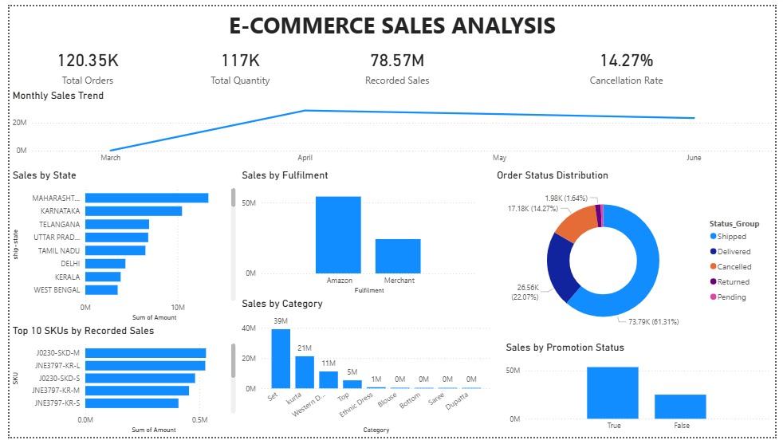

# E-Commerce Sales Analysis

## Project Overview

This project analyzes Amazon sales data to identify sales trends, top-performing product categories, geographic sales patterns, order statuses, and fulfilment performance.

The project uses Python for data cleaning and exploratory data analysis (EDA), MySQL for querying and analyzing sales data, and Power BI to create an interactive-style business dashboard.

## Tools and Technologies

* **Python** — data cleaning and analysis
* **Pandas** — data manipulation
* **Matplotlib and Seaborn** — data visualization
* **Jupyter Notebook** — exploratory data analysis
* **MySQL** — SQL queries and business analysis
* **Power BI** — dashboard development

## Project Workflow

1. Imported the raw Amazon sales dataset.
2. Cleaned the data using Pandas.
3. Handled missing values and standardized state names.
4. Created date-related features, including month, year, and day.
5. Performed exploratory data analysis.
6. Imported the cleaned dataset into MySQL.
7. Wrote SQL queries to analyze sales, orders, categories, states, fulfilment, promotions, and product SKUs.
8. Built a Power BI dashboard to present the findings.
9. Documented the key business insights.

## Dashboard

The dashboard presents key performance indicators and visualizations for:

* Total orders
* Total recorded sales
* Total quantity
* Cancellation rate
* Monthly sales trends
* Sales by product category
* Sales by state
* Sales by fulfilment method
* Order status distribution
* Top 10 SKUs by recorded sales
* Sales by promotion ID status

## Key Business Insights

* **Total orders:** 120,350 unique order IDs.
* **Total recorded sales:** Approximately ₹78.57 million.
* **Top category:** Set, with approximately ₹39.20 million in recorded sales.
* **Top state:** Maharashtra, with approximately ₹13.34 million in recorded sales.
* **Fulfilment:** Amazon fulfilment contributed approximately 69.12% of recorded sales.
* **Cancellation rate:** Approximately 14.27% of unique orders were classified as fully cancelled under the analysis rule.
* **Monthly trend:** Recorded sales declined from April through June 2022. June data ends on June 29.

See [Business Insights](Business_Insights.md) for additional findings.

## SQL Analysis

SQL queries were used to analyze:

* Overall sales and order metrics
* Category-wise sales and quantity
* Monthly sales trends and growth
* State-wise sales contribution
* Fulfilment performance
* Order status and cancellation rate
* Promotion ID status
* B2B versus non-B2B orders
* Top-selling SKUs
* Monthly running totals and rankings

## Dataset

The dataset contains Amazon order and sales records from March to June 2022.

The cleaned dataset contains **128,942 records and 28 columns**.

The dataset includes order dates, statuses, product categories, SKUs, quantities, amounts, shipping locations, fulfilment methods, and promotion-related fields.

## Dataset Source

* **Dataset:** Amazon Sale Report
* **Source:** [E-Commerce Sales Dataset — Kaggle](https://www.kaggle.com/datasets/thedevastator/unlock-profits-with-e-commerce-sales-data)
* **File used:** `Amazon Sale Report.csv`

The dataset contains Amazon India sales records, including order status, product category, quantity, sales amount, fulfilment method, shipping location, and promotion information.

The dataset was cleaned and transformed using Python and Pandas before being analyzed with SQL and Power BI.

**Note:** This project uses recorded sales amounts, not profit. The dataset does not provide the cost information needed to calculate profit.

## How to Explore the Project

1. Open `Ecommerce_Sales_Analysis.ipynb` in Jupyter Notebook or VS Code.
2. Review the Python cleaning and exploratory analysis.
3. Use `cleaned_amazon_sales.csv` for the cleaned data.
4. Run the SQL queries against the MySQL database after setting up the table.
5. Open `E-Commerce Sales Analysis.pbix` in Power BI Desktop to explore the dashboard.

## Important Notes and Limitations

* Recorded sales include multiple order statuses, including cancelled, pending, and returned orders. Therefore, recorded sales should not be interpreted as confirmed net revenue or profit.
* The cancellation rate is based on unique orders classified as fully cancelled under the project's order-status rule.
* A recorded promotion ID does not prove that a promotion caused an increase in sales.
* March contains data for only March 31, and June data ends on June 29.
* The dataset does not include sufficient cost information to calculate profit.

## Skills Demonstrated

Python, Pandas, data cleaning, exploratory data analysis, SQL, MySQL, data visualization, Power BI, KPI reporting, and business insight generation.

## Author

**Tanushree Sapkale**

Computer Engineering Student 
